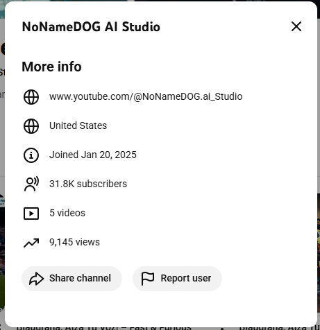

# 🚨 GOOGLE ADS FRAUD: THE IMPOSSIBLE NUMBERS

## Look at This YouTube Channel

**31,800 subscribers | 9,145 views**

### 🔗 **VERIFY IT YOURSELF:** [www.youtube.com/@NoNameDOG_ai_Studio](https://www.youtube.com/@NoNameDOG.ai_Studio)

**These are LIVE numbers from YouTube. Anyone can check them right now.**

---

## The Math Doesn't Work

To subscribe to a YouTube channel, you **must view content first**. That's how YouTube works.

So how does a channel have **3.5 times MORE subscribers than total views?**

**It doesn't. Unless the subscribers are fake.**

---

## I Paid Google Ads $2,100 for These "Subscribers"

**March 2025:** Ran a Google Ads campaign to promote my YouTube channel  
**Result:** Google reported 33,448 "successful conversions" (subscribers)  
**Reality:** The channel is dead, losing subscribers daily, zero organic growth

**The subscribers aren't real. Google charged me for fake metrics.**

---

## Then It Got Much Worse

When I started documenting this fraud and contacting Google support:

**March 14, 2025, 5:55 PM ET** - Google called me from their official support number **(404-978-8978)** and attempted to gain unauthorized access to my entire Google account through a deceptive security prompt.

**I declined. The login attempt was blocked.**

**The entire call is recorded.**

**After the unauthorized access attempt:**
- Google stopped responding to inquiries
- Attempts to reply to support emails were **blocked as "forbidden"**
- After approximately one week of silence: **Case closed with no explanation**
- No resolution, no refund, no investigation results
- Just a blank closure email - case dismissed with zero accountability

---

## WHAT HAPPENED

**March 2025:**
- Paid Google Ads **$2,100** to promote my YouTube channel
- Google reported **33,448 "successful conversions"** (subscribers)
- Campaign showed **78% conversion rate** (industry standard is 0.5-3%, typical is 1%)

**The Reality:**
- Channel has only **9,145 total views** in 10 months
- Losing subscribers daily (**down to 31,800**)
- **Zero organic growth** after ads stopped
- Channel is completely dead

**The Math:**
- You can't subscribe without viewing first
- Yet: 31,800 subscribers ÷ 9,145 views = 3.48 subs per view
- **Mathematically impossible**

---

## THEN IT GOT WORSE

When I started documenting the fraud and contacting Google support:

**March 14, 2025, 5:55 PM ET**  
Google called from their official support number: **(404) 978-8978**

During the call, they sent a deceptive security prompt asking me to confirm I was on the phone with them.

**If I had clicked "Yes"**: They would have gained full access to my entire Google account.

**I clicked "No"**: Received immediate confirmation that I had blocked a login attempt.

**The entire call is recorded.**

---

## THE SMOKING GUNS

### 1. The Impossible Screenshot
**31,800 subscribers | 9,145 views**  
You do the math.

### 2. The Impossible Campaign Metrics
- **More conversions than clicks** (3,620 conversions from 3,550 clicks)
- **78% conversion rate** (6.5x higher than "excellent" performance)
- **26,431 subscribers but only 1,939 video views** (13:1 ratio)

### 3. The Unauthorized Access Attempt
- Recorded call from Google's official number
- Deceptive security prompt
- Login attempt confirmation
- Representative hung up when questioned

### 4. The Dead Channel
- 8 months later, still no organic growth
- Losing subscribers daily
- Fake metrics destroyed the channel's potential

---

## THE EVIDENCE

Everything is documented:

✅ **70+ minutes** of recorded phone calls with Google support  
✅ **2+ minutes** of the unauthorized access attempt (recorded)  
✅ **Screenshots** of all impossible metrics from Google Ads  
✅ **YouTube Analytics** showing the dead channel  
✅ **Campaign receipts** showing $2,100 paid  
✅ **Email correspondence** with multiple Google support teams  
✅ **Complete timeline** of all events  

**This isn't speculation. This is documented fact.**

---

## READ THE FULL STORY

I've prepared three documents with increasing levels of detail:

### 📄 [**THE LANDING PAGE**](google_ads_fraud_landing_page.md) *(Start Here - 3 min read)*
Quick, punchy overview with all the key facts. Perfect for sharing.

### 📄 [**THE PUBLIC NARRATIVE**](google_ads_fraud_public.md) *(Full Story - 10 min read)*
Complete narrative of what happened, how it happened, and why it matters.

### 📄 [**THE COMPREHENSIVE CASE SUMMARY**](GOOGLE_ADS_FRAUD_COMPREHENSIVE_SUMMARY.md) *(Deep Dive - 20 min read)*
Everything: timeline, evidence breakdown, legal implications, damages analysis.

**Read all three or pick one. They tell the same story at different depths.**

---

## WHY THIS MATTERS

This isn't just about $2,100 or one YouTube channel.

**If Google did this to me, how many others are affected?**

Google Ads is a **$200+ billion annual business**.  
Even 1% fraud rate = **$2 billion stolen**.

**Small businesses are:**
- Making decisions based on fake metrics
- Wasting money on fake conversions
- Having their organic growth destroyed

**And when caught, Google tried to break into my account.**

---

## THREE QUESTIONS FOR GOOGLE

### 1️⃣ How does a channel have 31,800 subscribers but only 9,145 views?
You can't subscribe without viewing first.

### 2️⃣ How does an ad get 3,620 conversions from only 3,550 clicks?
You can't convert without clicking first.

### 3️⃣ Why did you try to access my account when I asked about this?
What were you planning to do?

---

## WHAT I'M SEEKING

🔍 **Investigation** - FTC, DOJ, State Attorneys General  
📰 **Media Coverage** - Expose this publicly  
⚖️ **Legal Action** - Civil and potentially criminal prosecution  
👥 **Other Victims** - If this happened to you too, contact me  

---

## SHARE THIS

The only way to stop fraud at scale is to expose it.

**One screenshot. One impossible number. One massive fraud.**

🔗 Share this repository  
📧 Forward to journalists  
💬 Post on social media  
⚖️ Send to lawyers  

---

## CONTACT

**For media inquiries, legal representation, or if you've experienced similar issues:**

*[Your contact information]*

**Evidence package available to:**
- Credentialed journalists
- Licensed attorneys  
- Law enforcement officials

---

## TIMELINE AT A GLANCE

| Date | Event |
|------|-------|
| **Jan 20, 2025** | Channel created |
| **Feb-Mar 2025** | Google Ads campaign runs ($2,100 spent) |
| **Mar 10, 2025** | Campaign ends: 33,448 "subscribers" reported |
| **Mar 14, 2025, 5:55 PM** | **Google attempts unauthorized account access** |
| **Mar 15-21, 2025** | Support emails blocked as "forbidden to reply" |
| **~Mar 21, 2025** | **Case closed by Google with no explanation or resolution** |
| **Mar-Nov 2025** | Channel dies, loses 1,600+ subs, no organic growth |
| **Nov 19, 2025** | Current stats: 31,800 subs, 9,145 views |

---

## THE BOTTOM LINE

**You can't have more subscribers than views.**

**You can't have more conversions than clicks.**

**You can't have 78% conversion rates when 1-3% is normal and 3% is considered excellent.**

**And you definitely can't try to hack someone's account when they question your fraudulent metrics.**

**Google did all of this. I have proof.**

---

**Last Updated:** November 19, 2025  
**Status:** Seeking investigation and legal representation  
**All recordings made in compliance with applicable recording laws**

---

# 📢 START HERE → [READ THE LANDING PAGE](google_ads_fraud_landing_page.md)

*Or jump straight to the [Public Narrative](google_ads_fraud_public.md) or [Comprehensive Summary](GOOGLE_ADS_FRAUD_COMPREHENSIVE_SUMMARY.md)*

---

## ⭐ Star this repository if you think this deserves investigation

## 🔄 Share if you want to help expose this fraud

## 📧 Contact if you've experienced similar issues

---

**THE MATH DOESN'T LIE. GOOGLE DOES.**
